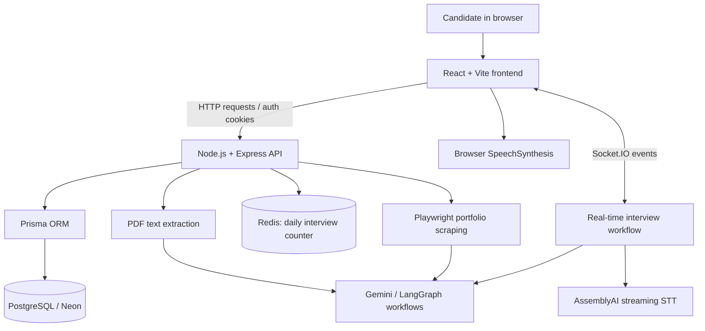

# Nexterview — AI-Powered Interview Preparation

> **Nexterview** is an AI-powered interview preparation platform designed to help candidates evaluate their resumes and portfolios and practise interviews with AI-generated questions, including a real-time voice interview experience.

> **Project status:** Built and deployed as a full-stack project. Review the sections marked **Verify/update** before publishing so this README reflects the exact production implementation.

<!-- Add screenshots or a demo GIF here once available. -->

## Table of Contents

- [Overview](#overview)
- [Key Features](#key-features)
- [Technology Stack](#technology-stack)
- [Architecture](#architecture)
- [How It Works](#how-it-works)
- [Technical Decisions](#technical-decisions)
- [Security and Reliability](#security-and-reliability)
- [Local Development](#local-development)
- [Environment Variables](#environment-variables)
- [Project Structure](#project-structure)
- [Challenges and Lessons Learned](#challenges-and-lessons-learned)
- [Limitations and Future Improvements](#limitations-and-future-improvements)
- [Author](#author)

## Overview

Preparing for technical interviews involves more than practising questions. Candidates also need to understand how their resumes present their skills, whether their portfolios communicate their impact, and how to explain their experience clearly.

Nexterview brings these activities together in one application. It combines a web interface, a backend API, persistent storage, AI-powered analysis, and a real-time voice interview workflow.

### Goals

- Help candidates identify strengths and gaps in their resumes.
- Give actionable feedback on portfolio content and presentation.
- Generate interview questions informed by the candidate's target role and available resume information.
- Support spoken interview practice and display the interview conversation in the UI.
- Build a practical full-stack system involving authentication, database operations, external APIs, AI orchestration, and real-time communication.

## Key Features

### 1. Resume Analyzer

- Accepts resume PDF uploads.
- Extracts text from the uploaded document on the server.
- Uses an LLM-based analysis workflow to generate feedback.
- Presents an overall assessment, strengths, weaknesses, suggestions, missing skills, and section-level scores where returned by the analysis.
- Stores analysis results separately from the original uploaded file.

### 2. Portfolio Analyzer

- Accepts a portfolio URL.
- Uses browser automation with Playwright to inspect portfolio pages, including pages whose content is rendered dynamically.
- Passes extracted page content to an LLM for evaluation.
- Produces feedback on areas such as projects, technical skills, impact, experience, presentation, documentation, and career relevance, depending on the analysis response.

**Important:** A scraper cannot reliably access every website. Authentication walls, bot protection, network errors, and unusual rendering can affect the result.

### 3. AI Mock Interviews

- Creates an interview based on the selected role, round, and experience level.
- Uses Gemini to generate interview questions.
- Uses LangGraph to organise the LLM interview workflow and its state.
- Can incorporate relevant resume skills, projects, and experience into the prompt when resume data is available.
- Uses interview duration to determine when the session should end.
- Applies a daily interview-start limit using Redis.

### 4. Real-Time Voice Interview

- Uses Socket.IO for real-time communication between the browser and backend.
- Uses AssemblyAI's streaming speech-to-text service for transcription.
- Uses browser speech synthesis to speak generated text in the frontend.
- Displays interview questions and candidate responses in the interface.
- Uses a temporary AssemblyAI token endpoint so the long-lived provider API key does not need to be exposed in the browser.

**Verify/update:** Document the exact audio flow, reconnection behaviour, and how the socket session is associated with an authenticated user before publishing.

### 5. Authentication and User Data

- Uses a React frontend and Node.js/Express backend.
- Uses Prisma to communicate with the database.
- Implements protected backend routes and a cookie-based refresh-token flow in the current authentication work.
- Uses HTTP-only cookies for refresh tokens, with cookie settings configured for the deployment environment.

**Verify/update:** Describe the final access-token storage and refresh flow exactly as implemented in the deployed version. Do not claim that all routes or cookie settings are secure without testing them in production.

## Technology Stack

| Area | Technology | Role in Nexterview |
|---|---|---|
| Frontend | React | User interface and feature pages |
| Frontend tooling | Vite | Development server and production build |
| Backend | Node.js | JavaScript runtime for server-side code |
| API framework | Express.js | HTTP routes, middleware, and controllers |
| Database access | Prisma ORM | Schema, queries, and database operations |
| Database | PostgreSQL (Neon) | Persistent application and analysis data |
| Cache / counters | Redis | Fast counter operations and expiry for interview limits |
| LLM provider | Google Gemini | Interview question generation and AI analysis |
| AI orchestration | LangGraph | Stateful interview workflow |
| Website inspection | Playwright | Browser-based extraction of portfolio content |
| Resume text extraction | `pdf-parse` | Extracts text from PDF buffers |
| Upload handling | Multer | Handles incoming resume files and size limits |
| Real-time messaging | Socket.IO | Browser/backend interview communication |
| Speech-to-text | AssemblyAI Streaming API | Converts spoken responses to text |
| Text-to-speech | Browser SpeechSynthesis API | Speaks generated questions in the browser |
| File/media hosting | Cloudinary, where used | Media storage for configured features |
| Deployment | Render / Vercel, as configured | Hosting for the deployed application |

> Only list Cloudinary, Render, Vercel, or any other service as part of the production stack if it is actually used by the current deployed version.

## Architecture

At a high level, Nexterview separates the browser interface, API/business logic, data persistence, and external AI/voice services.



This diagram is a conceptual overview. Update it if your final implementation routes audio, authentication, or LLM calls differently.

### Main responsibilities

- **Frontend:** Collects user input, uploads files, displays analysis reports, and provides the interview experience.
- **Express API:** Validates requests, applies authentication middleware, coordinates services, and returns results.
- **Prisma + PostgreSQL:** Stores users, interview records, and analysis data according to the final Prisma schema.
- **Redis:** Tracks interview starts using a per-user key and expiry.
- **AI services:** Generate structured resume/portfolio feedback and interview questions.
- **Real-time layer:** Carries interview events and supports streaming transcription workflows.

## How It Works

### Resume analysis flow

1. The user selects a PDF in the frontend.
2. The frontend submits the file as multipart form data.
3. Multer receives the upload in memory and enforces the configured file-size limit.
4. `pdf-parse` extracts text from the uploaded PDF buffer.
5. The analysis service sends the extracted text to the LLM and requests structured feedback.
6. The backend persists the resulting fields through Prisma, using an upsert where appropriate.
7. The frontend renders the score, summary, strengths, weaknesses, missing skills, and suggestions returned by the API.

**Design note:** Keep file validation, extraction failures, LLM failures, and database failures distinguishable so the UI can show useful errors.

### Portfolio analysis flow

1. The user submits a portfolio URL.
2. The backend validates the URL and invokes the scraping service.
3. Playwright loads the page and extracts relevant visible content.
4. The extracted text is passed to the portfolio analysis service.
5. The service requests a structured evaluation from Gemini.
6. Prisma stores the analysis result and the frontend displays the report.

**Security note:** URL-fetching features should defend against SSRF. Restrict unsupported schemes and private/internal IP ranges, validate redirects and resolved addresses, and apply timeouts and resource limits.

### Mock interview flow

1. The user configures the interview, such as role, round, experience, and duration.
2. The backend checks the user's daily interview limit in Redis.
3. The backend loads relevant resume information if it exists.
4. The interview workflow supplies the role, round, experience, resume context, and conversation history to Gemini.
5. LangGraph manages the workflow state and question-generation steps.
6. The next question is sent to the frontend.
7. The session continues until the configured duration or another end condition is reached.

The prompt should instruct the model to ask one question at a time, use the candidate's background where relevant, and adjust question difficulty appropriately. Model output still needs validation; prompts alone do not guarantee perfectly structured responses.

### Voice interaction flow

1. The browser requests a short-lived AssemblyAI streaming token from the authenticated backend endpoint.
2. The browser establishes the supported streaming connection and sends microphone audio according to the provider's protocol.
3. AssemblyAI returns transcription events.
4. The application forwards or processes the recognised text through its interview workflow.
5. The generated question is displayed and spoken using the browser's speech synthesis capability.

**Verify/update:** Confirm the exact sequence of socket events, audio transport, transcription finalisation, and interruption handling against your current source code.

## Technical Decisions

### Why React and Express?

React supports a component-based interface for the analyzer pages, dashboards, and interview UI. Express provides a straightforward way to define API routes and middleware. Using JavaScript across the frontend and backend also reduces context switching during development.

### Why Prisma?

Prisma provides a typed schema and a consistent API for database operations. It makes model relationships and queries easier to maintain than writing every query manually. Database migrations still require care: the schema, migration history, and actual database state must remain aligned.

### Why PostgreSQL with Neon?

PostgreSQL is a relational database suitable for structured user, interview, and analysis records. Neon provides hosted PostgreSQL, avoiding the need to manage a database server directly. Connection limits and pooling configuration still matter in serverless or horizontally scaled deployments.

### Why Redis for daily interview limits?

Redis supports atomic counter increments and key expiration. A key such as `interview:<userId>:count` can track interview starts over a time window. `INCR` is atomic, but incrementing and setting expiry should be designed carefully so failures cannot leave a counter without the intended TTL. A fixed 24-hour TTL from the first request is not the same as resetting at midnight; document the behaviour accurately.

### Why Gemini?

Gemini was selected as the LLM provider for the project's generation and analysis tasks. The provider can be called through a service layer, making it easier to change models or prompts without coupling every controller to a provider-specific SDK. Model choice should be evaluated against output quality, latency, cost, context limits, and rate limits.

### Why LangGraph?

An interview is a stateful workflow: it has context, previous turns, session conditions, and a decision about what happens next. LangGraph can model these steps and state transitions explicitly. For a simple one-shot prompt, a direct model call may be sufficient; graph orchestration becomes more useful when the workflow has multiple steps, branching, persistence, or interruptions.

### Why Playwright for portfolio analysis?

Some portfolio sites render their content with client-side JavaScript. A browser automation tool can load and inspect the rendered page, unlike a basic HTTP request that may only return a minimal HTML shell. The trade-off is greater resource usage and slower processing, so timeouts, concurrency limits, and safe URL handling are important.

### Why streaming speech-to-text?

Streaming transcription allows text to arrive while the user is speaking, reducing the delay compared with recording an entire answer and uploading it afterward. It also introduces additional concerns: microphone permissions, partial versus final transcripts, connection interruptions, and synchronising audio and interview state.

### Why browser speech synthesis?

The browser's SpeechSynthesis API avoids adding a separate text-to-speech provider for a basic spoken-question experience. Voice availability and pronunciation can vary by browser and operating system, so a hosted TTS service may be preferable if consistent voice quality becomes a requirement.

## Security and Reliability

Before publishing this section as a description of production guarantees, verify each item in the deployed code.

- Keep provider secrets on the server; never commit API keys, database URLs, or service-account credentials.
- Use environment variables and keep local `.env` files out of version control.
- Use HTTP-only cookies for refresh tokens where that is the implemented design, and configure `Secure`, `SameSite`, domain, path, and CORS settings for the deployment topology.
- Validate authentication and authorization on the server for every protected resource; hiding a frontend route is not sufficient.
- Validate upload type and size, handle malformed PDFs, and limit processing time and memory use.
- Validate portfolio URLs and prevent requests to loopback, private-network, link-local, and cloud metadata addresses. Re-check redirects and DNS resolution to reduce SSRF risk.
- Add timeouts, error handling, and rate limits around external AI and scraping services.
- Treat model output as untrusted data and validate its shape before saving or rendering it.
- Design socket authentication and room membership so users cannot join or read another user's interview session.
- Handle disconnects, expired tokens, duplicate events, and retries without accidentally creating duplicate interview records or questions.
- Avoid logging raw access tokens, refresh tokens, API keys, or unnecessary sensitive resume contents.

## Local Development

The following is a general setup guide. **Verify the actual repository layout, package scripts, and required services before using these commands.**

### Prerequisites

- Node.js version supported by the project's dependencies
- npm (or the package manager used by the repository)
- A PostgreSQL database
- Redis, if running the interview-limit feature locally
- API credentials for the configured Gemini and AssemblyAI services
- Playwright browser dependencies for portfolio scraping

### Setup

```bash
# Clone your repository
 git clone <YOUR_GITHUB_REPOSITORY_URL>
 cd <YOUR_REPOSITORY_DIRECTORY>
```

If the frontend and backend are separate applications, install dependencies in each directory:

```bash
cd <FRONTEND_DIRECTORY>
npm install

cd ../<BACKEND_DIRECTORY>
npm install
```

Configure the environment variables described below. Then run the database commands supported by your project:

```bash
npx prisma generate
npx prisma migrate deploy
```

Use `prisma migrate dev` only for local development when you intentionally want to create or apply development migrations. Do not casually reset a production database to fix migration drift.

Start the frontend and backend using the scripts defined in their respective `package.json` files, for example:

```bash
npm run dev
```

> The exact commands vary by repository structure. Replace the placeholders and verify scripts before publishing this README.

## Environment Variables

Do not put real credentials in this README. The names below are examples based on the project's known integrations; align them with the actual code.

| Variable | Purpose |
|---|---|
| `DATABASE_URL` | PostgreSQL connection string used by Prisma |
| `DIRECT_URL` | Direct database connection for migrations, if configured in Prisma |
| `REDIS_URL` | Redis connection URL |
| `GEMINI_API_KEY` | Gemini API key, if this is the name used in your code |
| `ASSEMBLYAI_API_KEY` | AssemblyAI server-side API key, if this is the name used in your code |
| `JWT_SECRET` | Signing secret, if using locally signed JWTs |
| `CLIENT_URL` | Allowed frontend origin, if used by CORS configuration |
| `NODE_ENV` | Runtime environment, commonly `development` or `production` |

Add any other variables required by the repository, such as cookie settings, Cloudinary credentials, or frontend API base URLs. Vite-exposed variables are bundled into client code, so **never place server secrets in variables prefixed with `VITE_`**.

## Project Structure

The exact tree depends on your repository. A possible high-level layout is:

```text
nexterview/
├── client/                 # React + Vite frontend
│   └── src/
│       ├── components/
│       ├── pages/
│       ├── services/       # API clients
│       └── ...
├── server/                 # Node.js + Express backend
│   ├── controllers/
│   ├── routes/
│   ├── middleware/
│   ├── services/           # AI, scraping, transcription helpers
│   ├── prisma/
│   │   └── schema.prisma
│   └── ...
└── README.md
```

Replace this illustrative tree with the actual repository folders and filenames.

## Challenges and Lessons Learned

Use this section to document the challenges you actually encountered. The prompts below are useful starting points; edit them so each entry reflects a real issue and the fix you shipped.

### Authentication across local and production environments

- **Problem:** Cookie behaviour, CORS, and token refresh can differ between localhost and a deployed frontend/backend on separate origins.
- **What to document:** The exact 401 or refresh failure, cookie attributes, `withCredentials`, CORS configuration, and how the final flow was verified.
- **Lesson:** Authentication is an end-to-end browser/server configuration, not just token-generation code.

### Database schema and migration drift

- **Problem:** Prisma's local migration history can disagree with the actual hosted database schema.
- **What to document:** The specific schema mismatch, migration error, recovery steps, and how you confirmed the final schema.
- **Lesson:** Migrations should be committed, reviewed, and applied consistently across environments.

### Real-time voice interaction

- **Problem:** Audio streaming, partial transcripts, socket events, and generated speech must remain synchronised.
- **What to document:** How audio is captured, how events are ordered, how final transcripts are distinguished from partial transcripts, and what happens after a disconnect.
- **Lesson:** Real-time applications need explicit session state and recovery behaviour.

### AI output and latency

- **Problem:** LLM output can be inconsistent, slow, or exceed the expected structure.
- **What to document:** Prompt constraints, output parsing and validation, error handling, and any latency or token-budget improvements you measured.
- **Lesson:** Reliable AI features require normal software engineering controls around model calls.

## Limitations and Future Improvements

Potential next steps—keep only those that match your plans:

- Add automated tests for authentication, analysis endpoints, and interview state transitions.
- Add robust reconnection and recovery for interrupted voice interviews.
- Validate and version structured LLM output schemas.
- Add observability for latency, external API failures, and model usage without logging sensitive content.
- Improve SSRF protections and resource limits for portfolio scraping.
- Add user-facing explanations of scoring criteria and the limitations of AI-generated assessments.
- Evaluate AI output quality against a consistent test set.
- Add accessibility support and test across browsers for speech features.
- Document data retention and provide a clear way to delete user data and analyses.


### A concise project explanation

Practise a 60–90 second answer using this outline:

> I built Nexterview, an AI-powered interview preparation platform. It brings together resume analysis, portfolio evaluation, and AI mock interviews. The frontend is built with React, while the backend uses Node.js and Express. Prisma and PostgreSQL store application data, Redis tracks interview usage limits, and Gemini powers AI analysis and question generation, with LangGraph organising the interview workflow. For voice practice, I integrated AssemblyAI streaming transcription and browser speech synthesis. One of the key engineering areas was coordinating authentication, external AI services, and real-time interaction into a reliable user experience.


## Author

**Teja vendra**

- GitHub: [https://github.com/TejaVendra](https://github.com/TejaVendra)
- Portfolio:[https://tejavendra.onrender.com/](https://tejavendra.onrender.com/)
- Live Demo: [https://nexterview-sigma.vercel.app/](https://nexterview-sigma.vercel.app/)

---

If you find this project interesting, feel free to explore the repository and share feedback.
